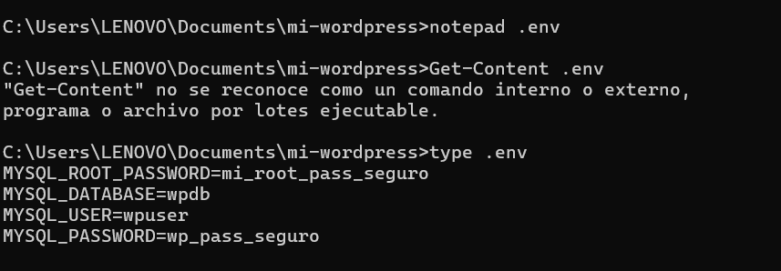

# Practica servidor web
## 1. Titulo
Wordpress con docker compose YML
## 2. Tiempo de duración
60 Minutos
## 3. Fundamentos:

La implementación de servidores web mediante contenedores representa una de las prácticas más comunes dentro del ámbito de la virtualización ligera. Docker facilita la creación, despliegue y gestión de aplicaciones empaquetadas junto con sus dependencias, garantizando un entorno reproducible, aislado y fácilmente transportable. En este contexto, Nginx se posiciona como uno de los servidores web más eficientes debido a su arquitectura basada en eventos, capaz de gestionar múltiples conexiones concurrentes sin comprometer significativamente los recursos del sistema.

Antes de utilizar Docker es importante comprender conceptos fundamentales como imagen, contenedor, Dockerfile, volúmenes y redes. Una imagen es una plantilla inmutable que incluye todo lo necesario para ejecutar un servicio o aplicación. Un contenedor, por otro lado, es una instancia viva de esa imagen, que puede iniciar, detenerse o eliminarse sin afectar la imagen original. Los volúmenes permiten persistir datos fuera del contenedor, evitando que se pierdan al eliminarlo. Las redes facilitan la comunicación entre múltiples contenedores, especialmente cuando se necesita desplegar aplicaciones con arquitectura distribuida.

En esta práctica, el foco principal será crear un contenedor basado en Nginx, configurarlo y verificar su funcionamiento. Además, se estudiará la estructura interna de los archivos de configuración de Nginx, los cuales definen directrices como la raíz de documentos (document root), los bloques de servidor (server blocks) y los puertos de escucha.

A través de este ejercicio, el estudiante comprenderá cómo se integran conceptos de virtualización ligera y administración de servidores web, así como las ventajas de automatizar entornos en comparación con instalaciones manuales tradicionales.

## 4. Conocimientos previos.
   
Para realizar esta práctica se debe manejar los siguientes conceptos:

Comandos Linux básicos (cd, mkdir, ls, cat, nano, etc.)

Navegación en entornos web

Conceptos generales de virtualización

Conocimientos básicos de redes

Uso de Docker a nivel inicial

## 5. Objetivos a alcanzar
   
Implementar un servidor web utilizando un contenedor basado en Nginx.

Manipular archivos de configuración dentro del contenedor.

Gestionar redes y volúmenes en Docker.

Validar el despliegue mediante navegador web.
  
## 6. Equipo necesario:
  
Computador con sistema operativo Windows.

Navegador web actualizado.

Cuenta en Docker.

Docker versión 24.x o superior instalado localmente.

Editor de texto como VSCode.

## 7. Material de apoyo.
Documentación oficial de Docker.

Guía de asignatura.

Docker CLI Cheat Sheet.

Documentación oficial de Nginx.
  
## 8. Procedimiento

Paso 1: Crea una carpeta para el proyecto y dentro los ficheros: mi-wordpress

Paso 2: docker-compose.yml (WordPress + MySQL + phpMyAdmin)

Paso 3:Crear .env sugerido

Paso 4:comandos para levantar todo

Paso 5:Gestión de volúmenes y red

 

## 9. Resultados esperados:
    
Al finalizar la práctica, el estudiante deberá visualizar correctamente el entorno WordPress levantado mediante Docker, confirmando que los servicios WordPress, MySQL y phpMyAdmin se encuentran funcionando. Se espera que el estudiante pueda acceder a:

La instalación inicial de WordPress en http://localhost:8080.

La interfaz de phpMyAdmin en http://localhost:8081.

Verificar que los contenedores están ejecutándose mediante comandos como docker ps.

Validar que los volúmenes fueron creados y asociados correctamente.

Comprobar la comunicación entre los servicios definidos en docker-compose.yml.

Asimismo, se requieren capturas de pantalla del navegador mostrando la instalación de WordPress, la interfaz de phpMyAdmin y la ejecución correcta de los comandos utilizados.

## 10. Bibliografía
    
Félix, A. (2023). Introducción a Docker y la virtualización ligera. Lima: EdTech Press.

Docker Inc. (2024). Docker Documentation. https://docs.docker.com

Nginx Foundation. (2023). Nginx Official Documentation. https://nginx.org

Peterson, L. (2022). Modern Web Servers and Deployment Strategies. New York: TechBooks.
